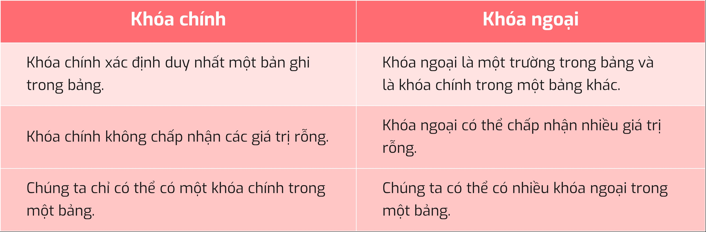
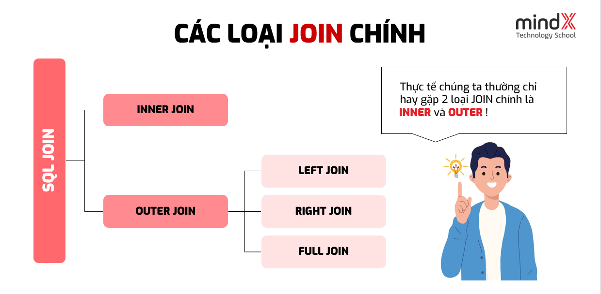
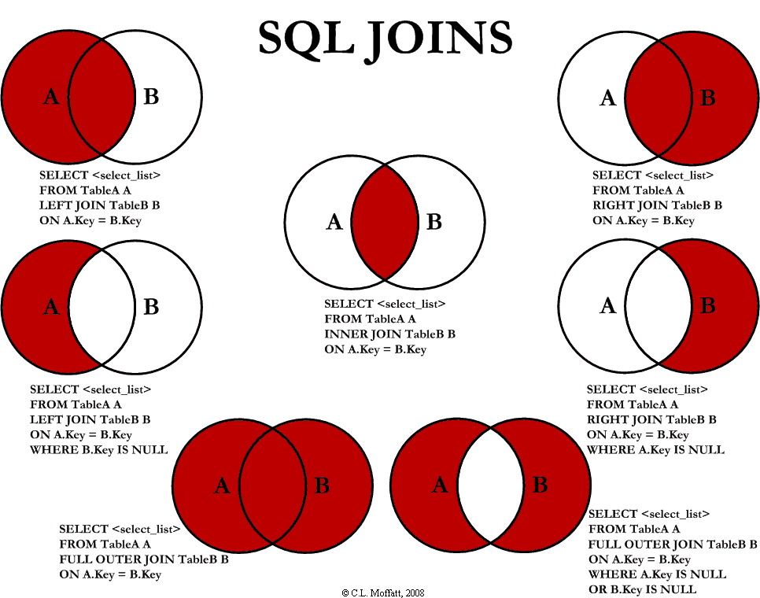
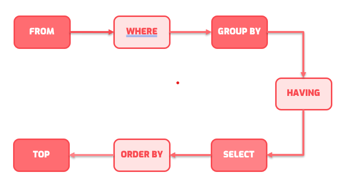
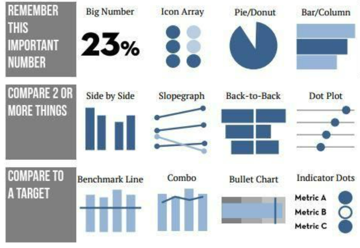
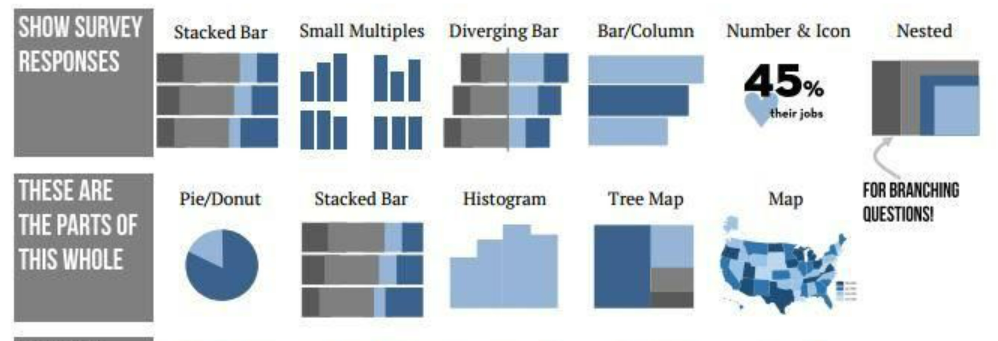
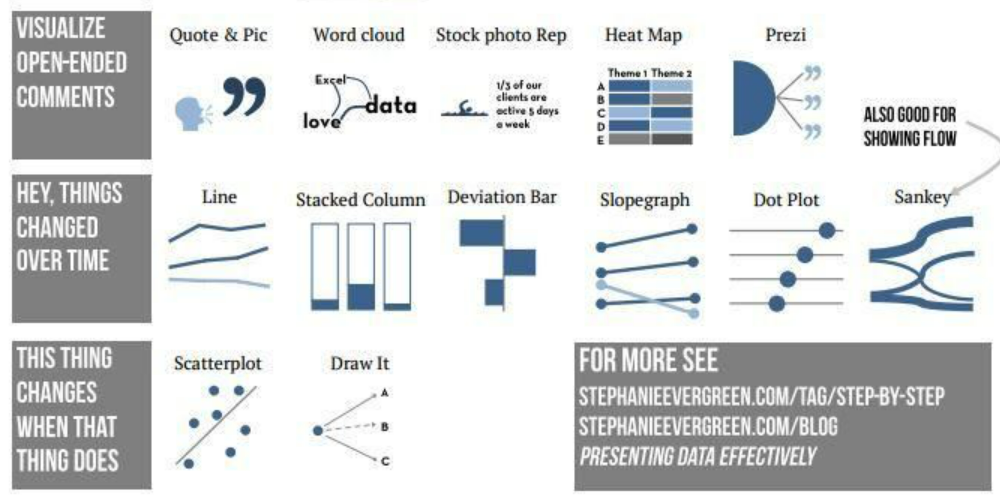
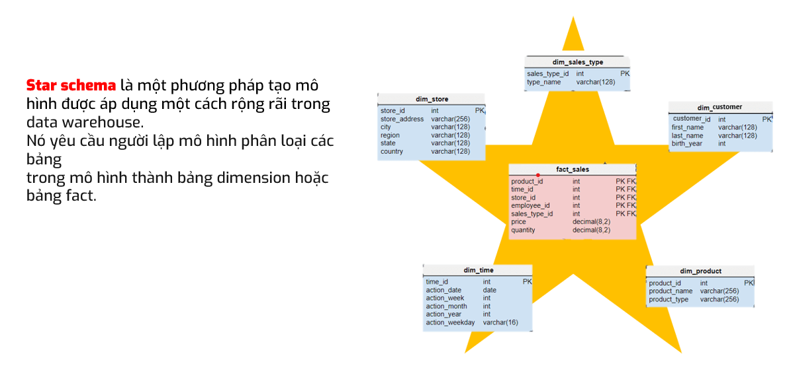
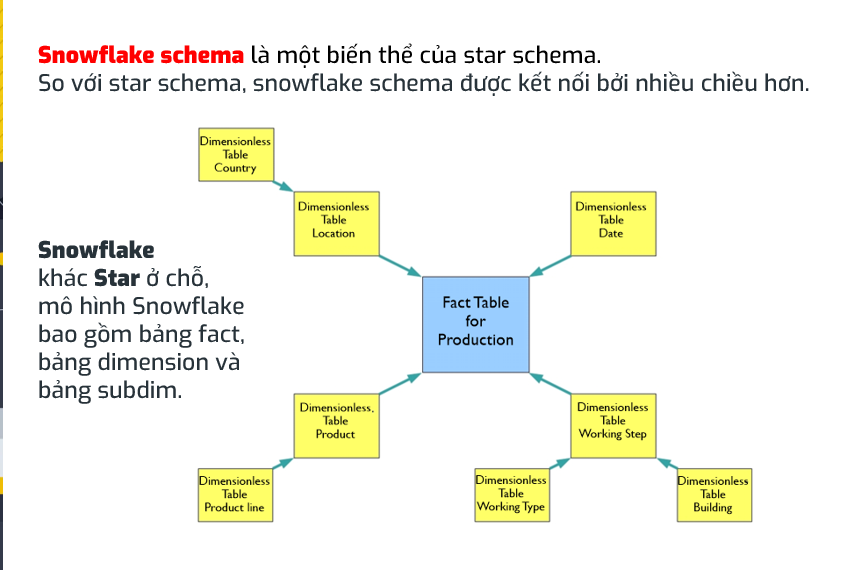

# **SQL**
## **Lec 1 - Overview on Data**

**2 Type of data**
- Qualitative
    + `Norminal`: Don't have natural order (Color, list of country)
    + `Ordinal`: Have a natural order (small -> medium -> large)
- Quantitative
    + `Discrete`: Have a finite values in a range (students in class)
    + `Continuous`: Take up any values in a specific range (weight)

**Ways to collect data**
    

**Database**

- Database is a place to store data

- RDBMS (Relational Database Management System): Allow users to access and process query to get data through SQL (Structured Query Language)

- Examples of RDBMS: Oracle, MySQL, SQL Server,...

**Data Type in SQL Server**


- Text data type:
    + `CHAR`: have fix length (Use in fields that we have specific length of that data)
Ex: `CHAR`(10) - Phone number
    + `VARCHAR`: Length of data can be varies
    + `NCHAR` / `NVARCHAR`: Use to specify Unicode letter

- Number data type: 
    + Exact numeric: `numeric`, `int`, `bit`, `decimal`
    + Appropriate numeric: `float`, `real`    

**Query Types in SQL**  

- DDL - Data Definition Language: Change or specify the structure of data (add/delele table/column)

=> `Create`, `Alter`, `Drop`, `Truncate`

- DML - Data Manipulation Language: Use to query data / affect rows of data

=> `Select`, `Insert`, `Update`, `Delete`

- DCL - Data Control Language

- TCL - Transaction Control Language

## **Lec 2 - Key in SQL and Relationship between tables**

**Key in SQL**

```
Key in SQL is a column or multiple columns used to identify and distinguish rows in a table from each other
```

- **Primary key**: Use to identify each row of data in the table (unique and not null)
- **Foreign key**: Use to mapping to another table



**Relationship in tables**

- One to One: 


- One to many: 


- Many to many:


**Logic operator in SQL**

| Basic | Others | 
| ---- | ---- |
| `AND` | `LIKE` | 
| `OR` | `BETWEEN - AND`|
| `NOT` | `ALL` |
| `IN` | `EXIST` |

**Functions to handle null values**

`isnull()` => Create column

`IS NULL / IS NOT NULL` => To chech if values null or not

## **Lec 3 - JOIN & UNION & USEFUL FUNCTIONS IN SQL**

**JOIN**




**UNION / UNION ALL**

```The selected union tables must have the same column and data type
```

=> UNION: Remove duplicate

## **Lec 4 - CASE - WHEN, GROUP BY, HAVING IN SQL**

**CASE - WHEN**

The `CASE` expression goes through conditions and returns a value when the first condition is met (like an if-then-else statement). So, once a condition is true, it will stop reading and return the result. If no conditions are true, it returns the value in the ELSE clause.

**GROUP BY**

The `GROUP BY` statement groups rows that have the same values into summary rows, like "find the number of customers in each country".

The `GROUP BY` statement is often used with aggregate functions (`COUNT(), MAX(), MIN(), SUM(), AVG()`) to group the result-set by one or more columns.

**HAVING**

The HAVING clause was added to SQL because the WHERE keyword cannot be used with aggregate functions.

**Thứ tự thực hiện câu lệnh**


## **Lec 5 - SUBQUERY - CTE - VIEW IN SQL**

**CTE**
```
CTEs work as virtual tables (with records and columns), **created during the execution of a query**, used by the query, and **eliminated after query execution**
```
* Syntax:  `With cte_name as ( ..query..)`

**VIEW**

```
In SQL, a view is a virtual table based on the result-set of an SQL statement 
```

=> Use to allocate access to Users in different departments

* Syntax: `Create view as ( ..query.. )`

# **Power BI**

## **Lec 6 - Power BI Overview**

```
Power BI is a powerful and popular data visualization tool, It allows you to build charts to visualizing data in order to Understand data better, discover hidden information in data, and support decision-making.
```

**Data Preparation**

Include the steps Collect and Clean data

We can connect data from different data sources to PBI such as: flat file, Azure, MS SQL, Web,...

**Data visualization**





## **Lec 7 - Data normalization**

**Power Query**

Data transformation main types: 

- Combine data: Merge, Append, Join
- Transform rows: promote header, remove rows, remove duplicates,...
- Transform columns: change type, replace values, split columns
- Others: group by, pivot, unpivot

**Data Normalization**

- 1NF: 
    - Tables should have primary key
    - Data in 1 Column should have the same data types

- 2NF
    - Has no partial dependency. That is, all non-key attributes are fully dependent on a primary key.

- 3NF
    
    - have no transitive partial dependency.

**Data Model**
```
Mô hình quan hệ thường được biểu diễn dưới 2 dạng lược đồ chính đó là : 
Star Schema (lược đồ hình sao)
Snowflake Schema (lược đồ hình bông tuyết)
```
- Star Schema



- Snowflake Schema



## **Lec 8 - DAX in Power BI**

**DAX - Data Analysis Expresion**
```
Formula or Function use to Calculate metric and Analyze data
```

