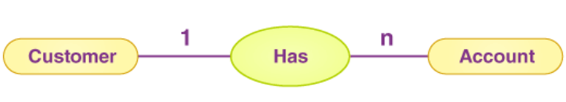
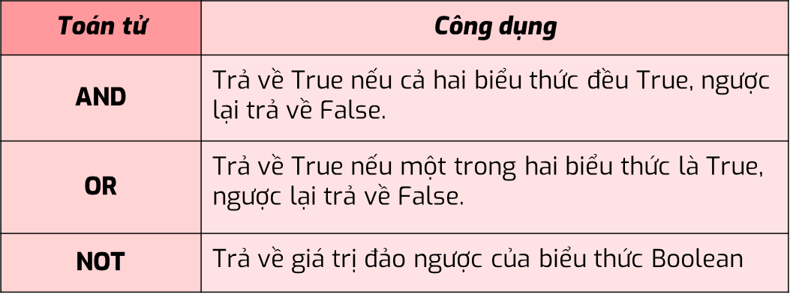
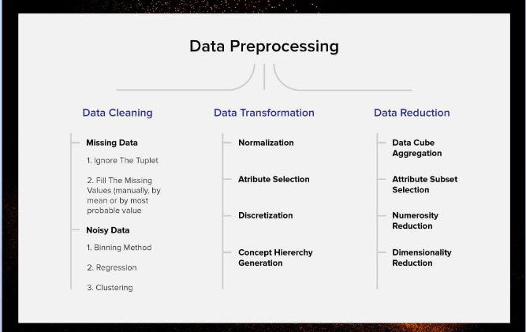

# **SQL**
## **Lec 1 - Overview on Data**

**2 Type of data**
- Qualitative
    + `Norminal`: Don't have natural order (Color, list of country)
    + `Ordinal`: Have a natural order (small -> medium -> large)
- Quantitative
    + `Discrete`: Have a finite values in a range (students in class)
    + `Continuous`: Take up any values in a specific range (weight)

**Ways to collect data**
    

**Database**

- Database is a place to store data

- RDBMS (Relational Database Management System): Allow users to access and process query to get data through SQL (Structured Query Language)

- Examples of RDBMS: Oracle, MySQL, SQL Server,...

**Data Type in SQL Server**


- Text data type:
    + `CHAR`: have fix length (Use in fields that we have specific length of that data)
Ex: `CHAR`(10) - Phone number
    + `VARCHAR`: Length of data can be varies
    + `NCHAR` / `NVARCHAR`: Use to specify Unicode letter

- Number data type: 
    + Exact numeric: `numeric`, `int`, `bit`, `decimal`
    + Appropriate numeric: `float`, `real`    

**Query Types in SQL**  

- DDL - Data Definition Language: Change or specify the structure of data (add/delele table/column)

=> `Create`, `Alter`, `Drop`, `Truncate`

- DML - Data Manipulation Language: Use to query data / affect rows of data

=> `Select`, `Insert`, `Update`, `Delete`

- DCL - Data Control Language

- TCL - Transaction Control Language

## **Lec 2 - Key in SQL and Relationship between tables**

**Key in SQL**

```
Key in SQL is a column or multiple columns used to identify and distinguish rows in a table from each other
```

- **Primary key**: Use to identify each row of data in the table (unique and not null)
- **Foreign key**: Use to mapping to another table


**Relationship in tables**

- One to One: 


- One to many: 


- Many to many:


**Logic operator in SQL**

| Basic | Others | 
| ---- | ---- |
| `AND` | `LIKE` | 
| `OR` | `BETWEEN - AND`|
| `NOT` | `ALL` |
| `IN` | `EXIST` |

**Functions to handle null values**

`isnull()` => Create column

`IS NULL / IS NOT NULL` => To chech if values null or not

## **Lec 3 - JOIN & UNION & USEFUL FUNCTIONS IN SQL**

**JOIN**


**UNION / UNION ALL**

```
The selected union tables must have the same column and data type
```
=> UNION: Remove duplicate

## **Lec 4 - CASE - WHEN, GROUP BY, HAVING IN SQL**

**CASE - WHEN**

The `CASE` expression goes through conditions and returns a value when the first condition is met (like an if-then-else statement). So, once a condition is true, it will stop reading and return the result. If no conditions are true, it returns the value in the ELSE clause.

**GROUP BY**

The `GROUP BY` statement groups rows that have the same values into summary rows, like "find the number of customers in each country".

The `GROUP BY` statement is often used with aggregate functions (`COUNT(), MAX(), MIN(), SUM(), AVG()`) to group the result-set by one or more columns.

**HAVING**

The HAVING clause was added to SQL because the WHERE keyword cannot be used with aggregate functions.

**Thứ tự thực hiện câu lệnh**


## **Lec 5 - SUBQUERY - CTE - VIEW IN SQL**

**CTE**
```
CTEs work as virtual tables (with records and columns), **created during the execution of a query**, used by the query, and **eliminated after query execution**
```
* Syntax:  `With cte_name as ( ..query..)`

**VIEW**

```
In SQL, a view is a virtual table based on the result-set of an SQL statement 
```

=> Use to allocate access to Users in different departments

* Syntax: `Create view as ( ..query.. )`

# **Power BI**

## **Lec 6 - Power BI Overview**

```
Power BI is a powerful and popular data visualization tool, It allows you to build charts to visualizing data in order to Understand data better, discover hidden information in data, and support decision-making.
```

**Data Preparation**

Include the steps Collect and Clean data

We can connect data from different data sources to PBI such as: flat file, Azure, MS SQL, Web,...

**Data visualization**


## **Lec 7 - Data normalization**

**Power Query**

Data transformation main types: 

- Combine data: Merge, Append, Join
- Transform rows: promote header, remove rows, remove duplicates,...
- Transform columns: change type, replace values, split columns
- Others: group by, pivot, unpivot

**Data Normalization**

- 1NF: 
    - Tables should have primary key
    - Data in 1 Column should have the same data types

- 2NF
    - Has no partial dependency. That is, all non-key attributes are fully dependent on a primary key.

- 3NF
    
    - have no transitive partial dependency.

**Data Model**
```
Mô hình quan hệ thường được biểu diễn dưới 2 dạng lược đồ chính đó là : 
Star Schema (lược đồ hình sao)
Snowflake Schema (lược đồ hình bông tuyết)
```
- Star Schema


- Snowflake Schema


## **Lec 8 - DAX in Power BI**

**DAX - Data Analysis Expresion**
```
Formula or Function use to Calculate metric and Analyze data
```


**Calculated Columns Vs Measures**

| Calculated Columns | Measures | 
| ---- | ---- |
| Create Calculated column in existing table | Dont Create Column | 
| Use when we want to create column for further calculation | Use when want to optimize report performance|
| Calculate row by row | Calculate overall |

**Usefull functions**

- `DATEDIFF()` - Calculate interval

- `DATEADD()` - Add interval to a date

- `DATEINPERIOD()` - Check whether <date> in specific range => return `True/False`

- `DATESYTD()` - Calculated YTD values

- `Calculate()` - Add filter base on given conditions

- `All()`- Remove filter in DAX measure

## **Lec 9 - Python Overview**

**Overview**

- Python is a **open source** programming language with a wide range community

- Python provide **simple syntax** for writting code

- Widely use in making **App, Web, Data analysis**,..

=> We use python to process large dataset (over million records)

**Python Syntax**

- **Line Structure**: In Python, a program is divided into a number of `logical lines` and every logical line is terminated by the token `NEWLINE`

- **Indentation**: in Python, indentation is very important as it is used to indicate a `block of code` (Must have the same number of spaces in the same block of code, otherwise Python will give you an error.)

- **Identifier**: Variable that we define in python (must follow some rules)

- **Comments**: Add # to add comments in python, use to explain or give more details about the code

**Variable**

We use variable to store and represent a values

We can change variable values 

* Ex: `a = 'Hello World'`

**Data type**


- **Numeric data type**: 
    - `Int`: Integer
    - `Float`: Số thực
    - `Complex`: Số phức 

- **Boolean**: Use to represent logic values (`True` / `False`)   

- **Sequence**:  Sequence data type allows users to access its elements through index (and can be slicing).
    - String `''`

        Ex: `x = 'We dont talk any more'` -->
            `x[0:1]` --> We

    - List `[]`

        Ex: x = [a, b, c, 1, 2, 3]

    - Tupple `()` (Can not change elements directly)

        Ex: x = (a, b, c, 1, 2, 3)


**Python Operator**

- Math Operator: 


- Logic Operator: 


- Comparation Operator


**Conditional Statement**


## **Lec 10 - For loop in Python**

**For loop in Python**

- For: `for i in range(1,1000):` - Use when we know how many time to loop.

```python
# Print sum of number from 1-100
x = 0
for i in range (1, 101):
    x = x + i
print(x)    
```
- While: `while i < 1000:` iteration when a condition is meet

```python
# Print sum of number from 1-100
x = 0
while i < 101:
    x = x + i
print(x)    
```

**Functions in Python**


## **Lec 11 - Pandas in Python**
**Dictionary datatype**

> In Python, a dictionary is a collection that allows us to store data in **key-value pairs**. A dictionary key can be almost any Python type, but are usually numbers or strings.

**Benefits of using dictionaries in Python:**

- Efficient for storing and retrieving data.
- Easy to use.
- Flexible and can be used to store a variety of data.

**Some character of Dictionary**

- Dictionaries are **unordered**, meaning that the order in which the key-value pairs are stored does not matter.
- Dictionaries are **mutable**, meaning that they can be changed after they are created. We can 
    - **Add** new key-value pairs to a dictionary
    - **Remove** existing key-value pairs
    - **Change** the value associated with a key

```python
dictionary = {"key1": "value1", "key2": "value2", "key3": "value3"}
```

**Pandas in Python**

> Pandas is a Python library for **data analysis**. It is a powerful tool that can be used to *read, manipulate, and analyze data* in a variety of formats. Pandas is often used in data science and machine learning applications.

**Here are some of the features of pandas:**

- Read data from a variety of file formats, including CSV, Excel, and JSON.
- It can be used to create and manipulate DataFrames, which are a powerful data structure for storing and analyzing data.
- It provides a wide range of statistical functions for analyzing data.
- It can be used to create visualizations of data.

**Here are some of the benefits of using pandas:**
- It is a powerful and versatile tool for data analysis.
- It is easy to use and learn.
- There is a large community of users and developers who can provide support.

**Pandas Useful Function with dataframe**
- Read data: `read_csv`
- General info about data:
    - `df.describe()`
    - `df.info()`
    - `df.isnull()`
    - `df.duplicated()`

- Change datatype:
    - `to_datetime()`
    - `to_numeric()`

- Data Manipulation:
    - `groupby()`
    - `merge()`
    - `append()`
    - `sort_values()`
    - `reset_index()`
    - `value_counts()`

## **Lec 12 - Preprocessing - EDA with Python**


**Step 1: Đánh giá dữ liệu**

Đánh giá dữ liệu là thao tác xem **thông tin tổng quan** về bộ dữ liệu, sau đó xem chi tiết dữ liệu và rút ra nhận xét đảm bảo dữ liệu phải đạt được : 

- Dữ liệu phải khớp : Ví dụ đơn vị tiền tệ cần đổi về 1 đơn vị tiền tệ duy nhất, đổi kiểu dữ liệu, …
- Dữ liệu phải được nhất quán: Ví dụ giới tính phải đồng nhất Man /Woman hoặc Male/Female, …
- Dữ liệu không có ngoại lai (Outlier): Các giá trị ngoại lai có thể xuất hiện do nhiều nguyên nhân trong quá trình thu thập dữ liệu. 
Ví dụ như lỗi đánh máy, lỗi xử lý code, … ảnh hưởng tới kết quả phân tích rất lớn. Ví dụ như nghiên cứu về giá nhà của 1 quận, nhưng lại có diện tích 1 ngôi nhà bị rất lớn, hoặc số âm, … 
- Dữ liệu không chứa giá trị thiếu (Missing Value)

**Step 2: Data Cleaning**

- Remove duplicate
- Handle Null values
- Change Data type (astype())
- Handle text values